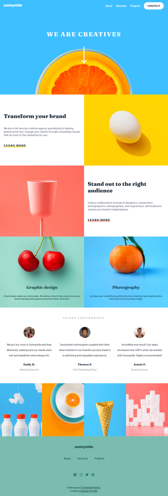

# Frontend Mentor - Sunnyside agency landing page solution

  <br>

This is a solution to the [Sunnyside agency landing page challenge on Frontend Mentor](https://www.frontendmentor.io/challenges/sunnyside-agency-landing-page-7yVs3B6ef). 
  
<br>

## Table of contents
  


-  [Overview](#overview)

-  [The challenge](#the-challenge)

-  [Links](#links)

-  [Screenshot](#screenshot)

-  [My process](#my-process)

-  [Built with](#built-with)

-  [What I learned](#what-i-learned)

-  [Continued development](#continued-development)

-  [Useful resources](#useful-resources)

-  [Author](#author)

<br>
  

## Overview

  <br>

### The challenge


Users should be able to:

  

- View the optimal layout for the site depending on their device's screen size

- See hover states for all interactive elements on the page

  
### Links

<br>
  

- Solution URL: [Solution URL](https://github.com/Gautam1201/Sunnyside-agency-landing-page.git)

- Live Site URL: [Sunnyside-landing-page](https://landing-page-sunnyside-agency.netlify.app/)
  
<br>

### Screenshot
  <br>


- ### DESKTOP VIEW
<br>
  
<br>
  
## My process
<br>
  

### Built with

- Semantic HTML5 markup

- CSS custom properties

- Flexbox

- CSS Grid

- Mobile-first workflow

  
<br>

### What I learned

<br>  

- While buliding this project, I learned about the <b>\<picture\></b> tag which can be used to specify different image resources for different viewport width or screen-size.

  
HTML Snippet for <em>\<picture\></em> tag

```html

<picture>

<source

	media="(min-width: 850px)"
	srcset="./images/desktop/image-stand-out.jpg"

/>

<source  srcset="./images/mobile/image-stand-out.jpg"  />


</picture>

```

<br>

- I also learned how to use filter tag to edit color of <strong>SVG</strong> Icon.

<br>

CSS Snippet: 

```css
.svg-icon:hover{
	filter: brightness(0) invert(1);
}
```
  <br>

### Continued development

This was my first landing page web site. I would like to continue practicing building landing page website and layouts using CSS Grid and Flexbox.
  
<br>

### Useful resources

-  [Picture tag \<W3-School\>](https://www.w3schools.com/tags/tag_picture.asp) - This helped me understand the concept of picture tag.
-  [Editing Color of SVG Icon](https://medium.com/@union_io/swapping-fill-color-on-image-tag-svgs-using-css-filters-fa4818bf7ec6) - This is an amazing article which helped me understand how to use CSS Filter to edit the color of .svg img.

<br>

## Author
 
- Frontend Mentor - [@Gautam1201](https://www.frontendmentor.io/profile/Gautam1201)

- Github - [@Gautam1201](https://github.com/Gautam1201)
 